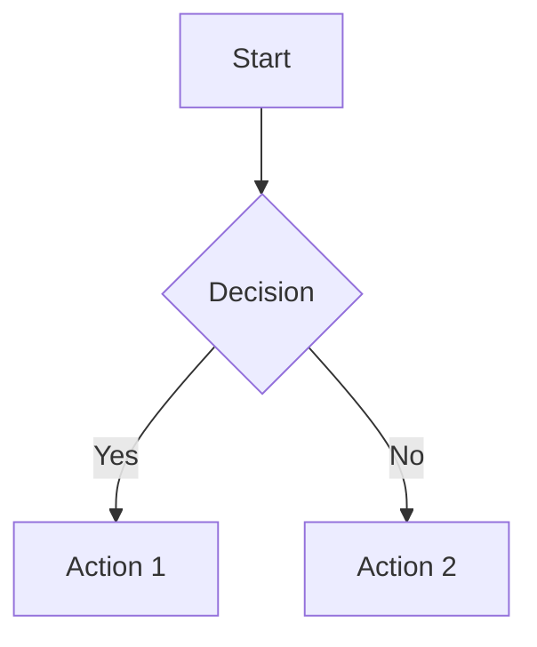

# Mermaid Diagrams in Hugo

Этот сайт поддерживает Mermaid диаграммы для красивой визуализации архитектуры и процессов.

## Как использовать

### Способ 1: Code Block (рекомендуемый)
```markdown


### Способ 2: Shortcode (альтернативный)
```markdown

sequenceDiagram
    participant A as Client
    participant B as Server
    A->>B: Request
    B->>A: Response

```

## Поддерживаемые типы диаграмм

- **Flowchart**: Блок-схемы и процессы
- **Sequence Diagram**: Диаграммы последовательности
- **Graph**: Направленные и ненаправленные графы  
- **Pie Chart**: Круговые диаграммы
- **Journey**: Пользовательские пути
- **GitGraph**: Git ветки и коммиты

## Настройки темы

Диаграммы автоматически адаптируются к светлой/тёмной теме сайта.

## Стилизация

Mermaid диаграммы стилизованы в соответствии с дизайном сайта:
- Адаптивный дизайн для мобильных устройств
- Поддержка тёмной темы
- Консистентная цветовая схема

## Техническая реализация

- **Render Hook**: Автоматический рендеринг code blocks
- **CDN**: Mermaid v10 загружается с jsdelivr
- **Performance**: Загрузка только на страницах с диаграммами