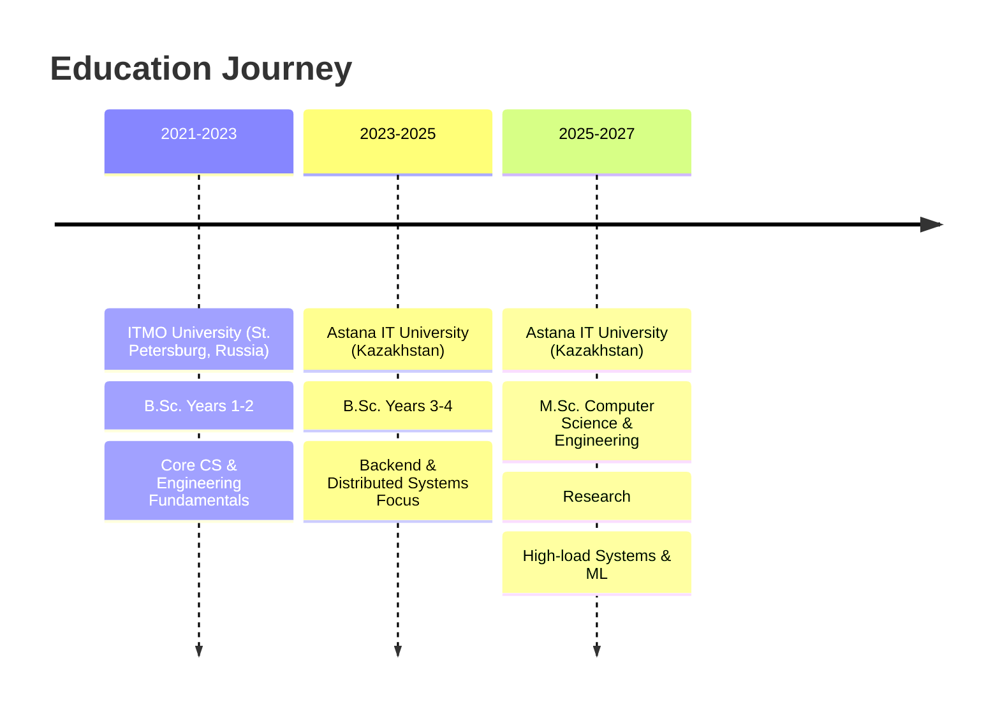

<div align="center">

# 👋 Hi, I'm Roman Vassilchenko

[](https://git.io/typing-svg)

**Building scalable systems that process millions of requests**
Currently developing **auto loan platforms** at Bereke Bank

[](https://romanv.dev)
[](mailto:roman.vassilchenko.work@gmail.com)
[](https://t.me/Roman_Vassilchenko)
[](https://www.linkedin.com/in/rovassilchenko/)

</div>

---

## 🚀 About Me

```go
type Developer struct {
    Name           string
    Role           string
    Location       string
    CurrentFocus   []string
    Specialization []string
}

me := Developer{
    Name:     "Roman Vassilchenko",
    Role:     "Go Backend Engineer",
    Location: "Kazakhstan 🇰🇿",
    CurrentFocus: []string{
        "High-load financial systems",
        "BPMN orchestration with Camunda",
        "Microservices architecture",
    },
    Specialization: []string{
        "Distributed systems",
        "Event-driven architectures",
        "Performance optimization",
    },
}
```

<div align="center">

### 📊 Quick Stats


</div>

---

## 💼 Professional Experience

### 🏦 **Bereke Bank** — Middle Backend Developer

**Auto Loan Issuance Team** · `Sep 2024 – Present`

Building **collateralized auto loan systems** with complex orchestration and external integrations.

```yaml
Achievements:
  - Credit issuance workflows using Camunda BPMN orchestration
  - Integration with government services (state registries, identity verification)
  - Microservice architecture for internal banking system integrations
  - Real-time credit scoring and decision-making pipelines
  - High-load financial transaction processing with strict consistency
```

**Tech**: `Go` `PostgreSQL` `Camunda` `Kafka` `Docker` `Microservices`

---

### 📦 **Ozon** — Junior Go Developer

**Staff Team** · `Sep 2023 – Sep 2024`

Built and maintained **internal HR-tech platforms** serving **60,000+ employees**.

```yaml
Key Achievements:
  - ⚡ Refactored RPC communication layer → improved reliability
  - 🚀 Boosted ElasticSearch performance 2.5× in complex search scenarios
  - 📉 Migrated legacy monolith components → -25% core load
  - 🔧 Contributed to shared internal libraries adopted across teams
```

**Tech**: `Go` `PostgreSQL` `ElasticSearch` `Kafka` `Redis` `Grafana`

---

### 🎯 **Ozon** — Go Backend Intern

**Matrix Hiring Team** · `Dec 2023 – Aug 2024`

Developed core features for high-scale recruitment and workflow management system.

```yaml
Contributions:
  - Implemented point-hiring workflow automation
  - Optimized database queries and API response times
  - Integrated ElasticSearch for candidate search
  - Built monitoring dashboards for real-time health tracking
```

**Tech**: `Go` `PostgreSQL` `ElasticSearch` `Kafka`

---

## 🛠️ Tech Stack

<div align="center">

### Languages & Frameworks


### Databases & Storage


### Message Brokers & Orchestration


### Monitoring & Observability


### DevOps & Tools


</div>

---

## 🎯 Featured Projects

<table>
<tr>
<td width="50%">

### 📊 AdalQarau (ex-DACA)

**Public Procurement Analytics Platform**

Risk scoring system for Kazakhstan's public procurement. Graph-based relationship analysis, Excel exports. Actively used by law enforcement agencies.

**Stack**: `Go` `PostgreSQL` `MinIO` `Kafka` `GraphQL` `Buf`

**Highlights**:

- 🔍 Complex fraud detection algorithms
- 📈 Real-time data processing
- 🗂️ Advanced Excel report generation

</td>
<td width="50%">

### 👥 Staff Portal 2.0

**Next-Gen Internal HR Platform**

Microservices-based HR platform with real-time analytics and smart routing for 60,000+ employees.

**Stack**: `Go` `PostgreSQL` `Kafka` `Redis` `Grafana`

**Highlights**:

- ⚡ Event-driven architecture
- 📊 Real-time analytics dashboard
- 🔄 Smart workflow routing

</td>
</tr>
<tr>
<td width="50%">

### 🎯 Matrix Hiring System

**High-Scale Recruitment Platform**

Point-hiring workflow management system handling thousands of candidates and hiring processes.

**Stack**: `Go` `PostgreSQL` `ElasticSearch` `Kafka`

**Highlights**:

- 🔍 Advanced candidate search
- 📈 Workflow automation
- 📊 Real-time monitoring

</td>
<td width="50%">

### 🚀 More Coming Soon

Currently working on:

- Financial microservices at Bereke Bank
- Personal blog at romanv.dev
- Open-source contributions

</td>
</tr>
</table>

---

## 🎓 Education



---

## 🎯 Current Focus

```go
// What I'm working on right now
currentGoals := map[string][]string{
    "Work": {
        "Building auto loan platforms with Camunda BPMN",
        "Designing microservices for banking systems",
        "Optimizing high-load financial transaction processing",
    },
    "Learning": {
        "Advanced BPMN orchestration patterns",
        "Financial system architecture best practices",
        "Distributed tracing and observability",
    },
    "Side Projects": {
        "Personal blog at romanv.dev",
        "Open-source contributions",
        "Technical writing and documentation",
    },
}
```

---

<div align="center">

### 💡 "Building systems that scale, one microservice at a time"


[](https://github.com/RomanVassilchenko)

**📫 Let's connect and build something amazing together!**

</div>
