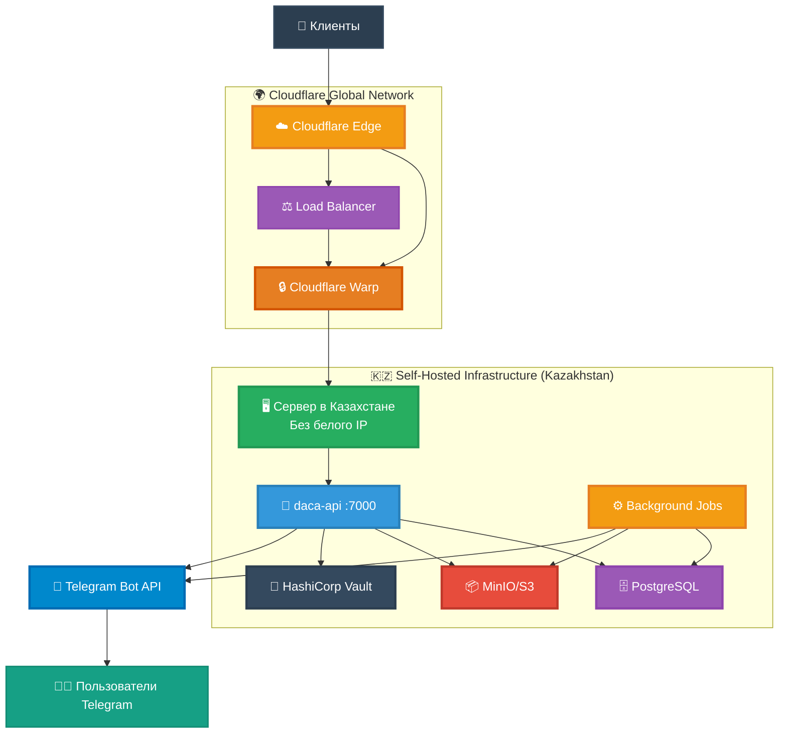
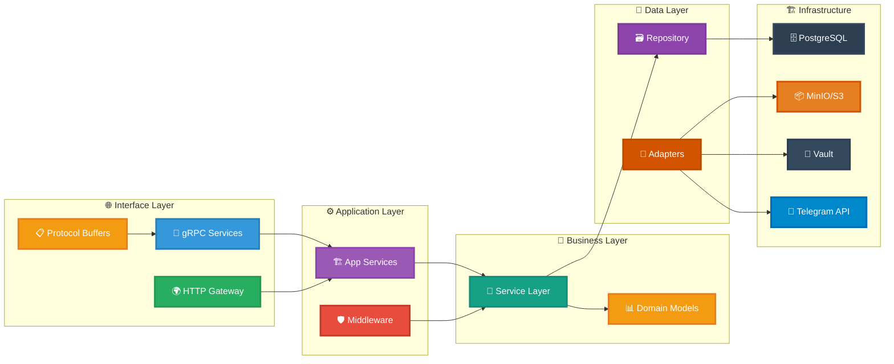
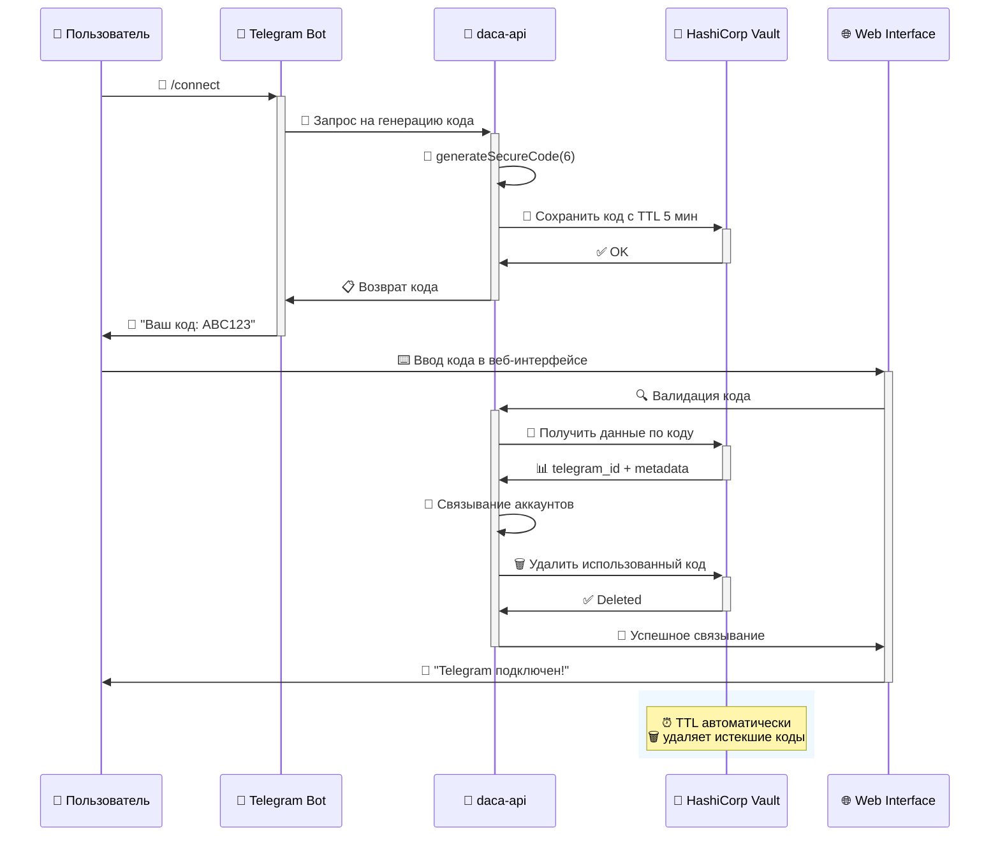
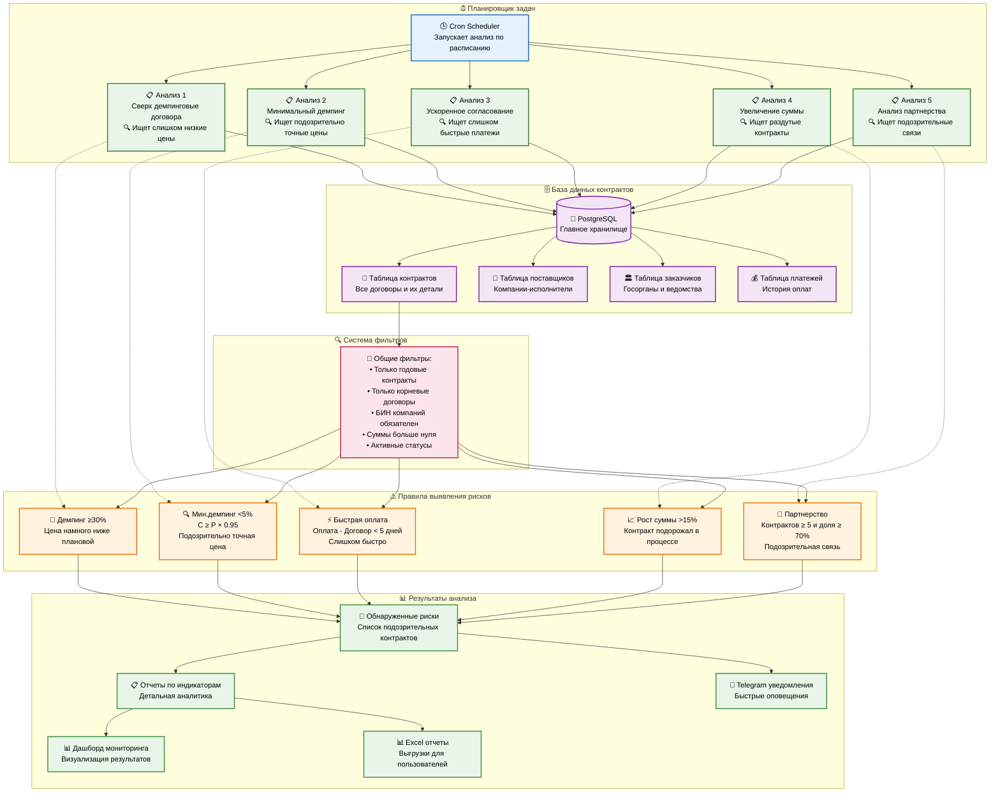
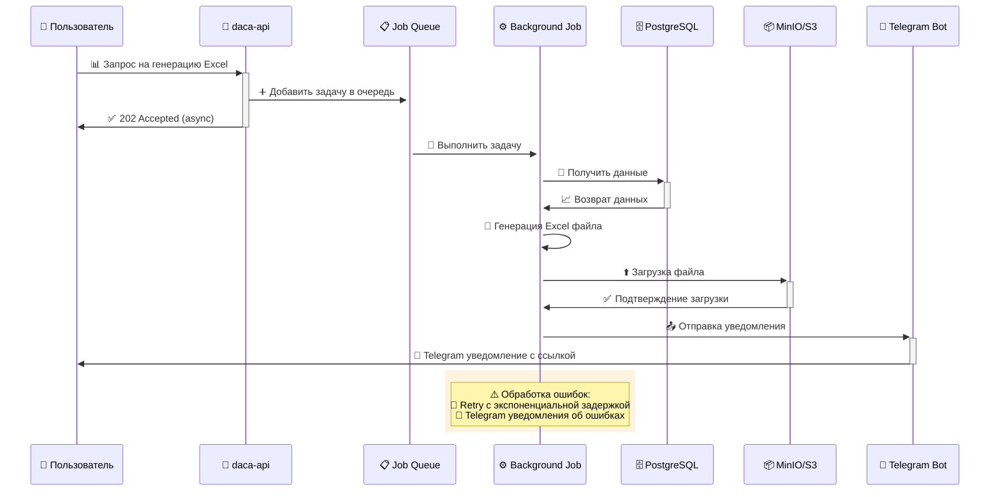
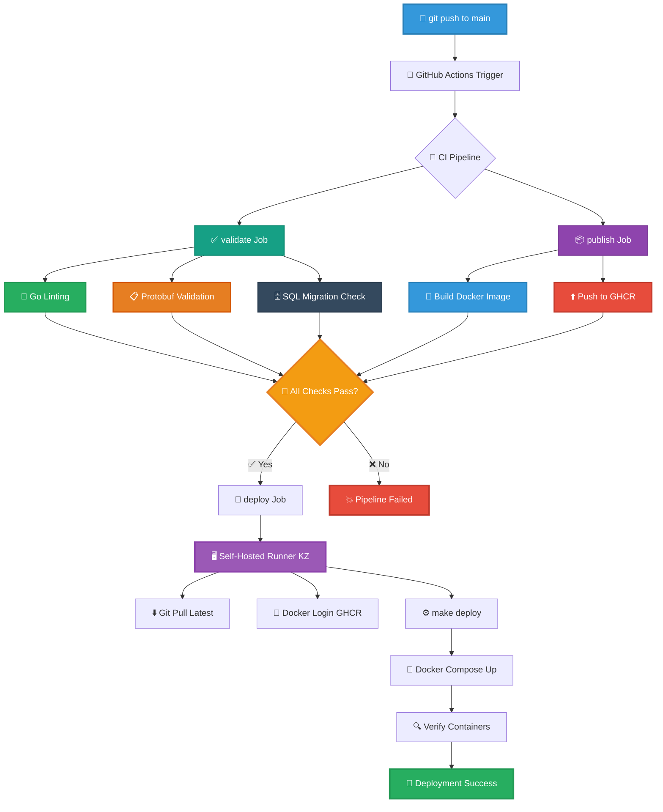
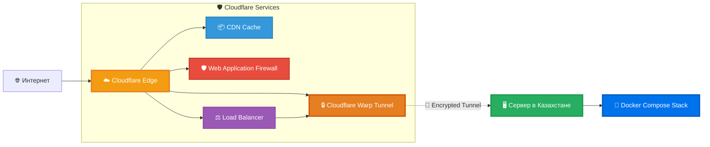

## 📖 Для кого эта статья

**🎯 Целевая аудитория:**

- **IT-специалисты**: Разработчики, архитекторы, DevOps-инженеры
- **Аналитики**: Специалисты по данным и бизнес-аналитики
- **Заказчики**: Представители государственных органов и бизнеса
- **Студенты**: Изучающие современные архитектурные подходы

**📚 Уровни сложности в статье:**

- 🟢 **Базовый**: Общие концепции и бизнес-логика
- 🟡 **Средний**: Техническая реализация и компоненты
- 🔴 **Продвинутый**: Детали архитектуры и код

> 💡 **Совет**: Читатели без технического бэкграунда могут сосредоточиться на разделах с зелеными и желтыми маркерами, пропуская красные разделы с техническими деталями.

> Эта статья — не просто список фактов, а связный рассказ о том, **зачем** мы выбрали такую архитектуру, **как** она устроена изнутри и **какие практические задачи** решает каждый блок. Текст задуман как «сквозной тур» по системе AdalQarau: от внешнего контура и сетевой топологии — до бизнес‑правил, пайплайнов Excel и стратегии деплоя на self‑hosted инфраструктуре под зонтиком Cloudflare.

Комплексная система анализа государственных закупок, построенная на современных принципах архитектуры с разделением ответственности, type-safe контрактами и автоматизацией процессов. Ни один фрагмент знаний не потерян: диаграммы, схемы, кодовые фрагменты и точные параметры оставлены и дополнены контекстом — чтобы читатель понял не только «что есть», но и «почему так».

## 🟢 Основные понятия и термины

Для лучшего понимания статьи рассмотрим ключевые понятия простым языком:

### Что такое AdalQarau?

**AdalQarau** — это система автоматического анализа государственных закупок, которая помогает выявлять подозрительные контракты и потенциальные нарушения. Представьте её как "умный детектор", который просматривает тысячи документов о закупках и находит аномалии.

### Ключевые термины

**🏗️ Архитектура** — это план построения системы, как чертёж здания. Определяет, какие компоненты где расположены и как они взаимодействуют.

**🔄 API (интерфейс)** — способ, которым разные программы "разговаривают" друг с другом. Как телефонная связь между компьютерами.

**🗄️ База данных** — организованное хранилище информации. Как огромная картотека, но в электронном виде.

**☁️ Облачные сервисы** — компьютерные ресурсы, доступные через интернет. Как аренда вычислительной мощности вместо покупки собственного суперкомпьютера.

**🤖 Автоматизация** — выполнение задач без участия человека. Система сама анализирует данные, генерирует отчёты и отправляет уведомления.

**📊 Аналитика** — процесс изучения данных для выявления закономерностей и аномалий. Как работа детектива, но с числами и алгоритмами.

### Что делает система?

1. **Собирает данные** о государственных контрактах
2. **Анализирует** их по различным критериям риска
3. **Выявляет подозрительные случаи** (демпинг, сговоры, etc.)
4. **Генерирует отчёты** для проверяющих органов
5. **Уведомляет** ответственных лиц о найденных проблемах

## 🟢 Методика выявления коррупционных рисков

AdalQarau реализует научно обоснованную **методику автоматизированного выявления коррупционных рисков** в системе государственных закупок. Эта методика была разработана для практического применения контролирующими органами.

### Цель и назначение методики

**Основная цель**: Выявление договоров, содержащих признаки коррупционных рисков, путём автоматизированного анализа закупочной деятельности на основе открытых данных.

**Целевая аудитория методики**:

- **Правоохранительные органы** — для оперативного выявления подозрительных сделок
- **Агентство по делам государственной службы** — для превентивного контроля
- **Практикующие прокуроры** — для подготовки материалов к проверкам
- **Аналитики и аудиторы** — для комплексной оценки рисков в закупках

### Трёхэтапный алгоритм работы

#### 🟢 Этап 1: Автоматический сбор данных

- **Источник**: GraphQL-API официального сайта goszakup.gov.kz
- **Технология**: Golang-скрипты, запускаемые по расписанию через Cron
- **Результат**: Централизованное хранилище всех данных о госзакупках в PostgreSQL

#### 🟡 Этап 2: Анализ рисков по 5 индикаторам

1. **Сверхдемпинговые договора** (снижение цены ≥30%)
2. **Минимальный демпинг** (снижение цены <5%)
3. **Ускоренное согласование оплаты** (менее 5 дней)
4. **Увеличение суммы договора** (рост >15%)
5. **Интенсивное партнёрство** (≥5 контрактов и доля ≥70%)

#### 🟢 Этап 3: Генерация отчётов и уведомлений

- **Excel-отчёты** с детальной разбивкой по каждому индикатору
- **Telegram-уведомления** о критических находках
- **Веб-дашборды** для мониторинга трендов
- **Классификация** найденных нарушений по уровню риска

### Преимущества автоматизированного подхода

- **Полнота охвата**: Анализируются ВСЕ контракты, а не выборочные проверки
- **Объективность**: Исключается человеческий фактор в первичной оценке
- **Оперативность**: Выявление рисков в режиме реального времени
- **Масштабируемость**: Система может обрабатывать миллионы записей
- **Прозрачность**: Все расчёты основаны на открытых данных и проверяемых формулах

## 🟢 Зачем эта архитектура и кому она нужна

AdalQarau создавалась как **прикладная аналитическая платформа** для госзакупок: выявлять аномалии, строить рисковые профили, ускорять проверку гипотез и давать прозрачные отчёты. Нам нужен был **контракт‑first API**, детерминированная фонова́я обработка, строгая типобезопасность и инфраструктура, которая надёжно живёт **в Казахстане** (вблизи основной аудитории), но при этом **без белого IP**, за счёт защищённого туннеля через Cloudflare.

---

## 🟡 Обзор архитектуры

Система построена по принципу модульной архитектуры с чётким разделением слоёв и использованием современного технологического стека. Ниже — «карта местности», где видно, как клиенты попадают на Edge, как трафик уходит в защищённый туннель Warp и как сервисы взаимодействуют внутри self‑hosted окружения.

### Общая архитектура системы



---

## 🟡 Технологический стек

Под капотом — проверенные временем инструменты. Мы сознательно выбрали стек, который даёт типобезопасность, предсказуемую производительность и зрелые экосистемы.

- **Язык**: Go 1.24.4
- **API**: gRPC + gRPC-Gateway (dual gRPC/REST)
- **База данных**: PostgreSQL 15+ с pgx драйвером
- **Файловое хранилище**: MinIO (S3‑совместимое)
- **Аутентификация**: JWT с ролевой моделью доступа
- **Генерация кода**: Protocol Buffers + buf toolchain
- **Уведомления**: Telegram Bot API
- **Управление секретами**: HashiCorp Vault
- **Фоновые задачи**: go-co-op/gocron v2

---

## 🔴 Архитектурные принципы

Чтобы не превращать систему в «комок зависимостей», мы опираемся на Hexagonal Architecture. Это позволяет сохранять чёткие границы между слоями, наращивать функциональность без каскада регрессий и безопасно эволюционировать API.

```
┌─ Interface Layer   ─┐  ┌─ Application Layer ─┐  ┌─ Domain Layer   ─┐  ┌─ Infrastructure  ─┐
│ • gRPC/HTTP         │  │ • Services          │  │ • Business Logic │  │ • PostgreSQL      │
│ • Protocol Buffers  │  │ • Use Cases         │  │ • Entities       │  │ • MinIO/S3        │
│ • REST Gateway      │  │ • Orchestration     │  │ • Value Objects  │  │ • Telegram API    │
└─────────────────────┘  └─────────────────────┘  └──────────────────┘  └───────────────────┘
```

**Ключевые архитектурные решения:**

- **Инверсия зависимостей (Dependency Inversion)**: Интерфейсы задают контракты, реализации инжектируются.
- **Принцип единственной ответственности (Single Responsibility)**: У компонента одна причина для изменения.
- **Разделение интерфейсов (Interface Segregation)**: Клиенты не зависят от лишних методов.
- **Fail‑fast**: Ошибки выявляются и сообщаются сразу.

---

## 🔴 Архитектура Backend

### Структура проекта

Дерево репозитория отражает логические границы: приложение, домен, инфраструктура и адаптеры наружу.

```
cmd/
├── api/              # Главный API сервер
└── cronjobs/         # Фоновые процессы
    ├── telegram_bot/      # Telegram бот
    └── process_*/         # Аналитические процессы

internal/
├── app/              # Бизнес-логика приложения
│   ├── auth/             # Аутентификация и авторизация
│   ├── contract_diff/    # Анализ различий контрактов
│   ├── dumping_contracts/ # Обнаружение демпинга
│   └── unload_excel/     # Генерация Excel отчетов
├── service/          # Сервисный слой
├── repository/       # Слой доступа к данным
├── model/            # Доменные модели
│   ├── auth/             # Модели аутентификации
│   ├── contract/         # Модели контрактов
│   └── company/          # Модели компаний
├── adapter/          # Адаптеры внешних сервисов
│   ├── s3/               # MinIO/S3 интеграция
│   ├── telegram/         # Telegram Bot API
│   └── vault/            # HashiCorp Vault
├── pb/               # Генерируемые Protocol Buffer типы
├── middleware/       # HTTP/gRPC middleware
└── tools/            # Вспомогательные утилиты

api/                  # Protocol Buffer определения
migrations/           # Миграции базы данных
```

### Слои архитектуры (схема, backend)

Схема ниже показывает транспорты (gRPC/HTTP), слой оркестрации, доменные сервисы и то, как репозитории и адаптеры сходятся на инфраструктуре — PostgreSQL, MinIO/S3, Vault и Telegram API.



---

## API‑дизайн на базе Protocol Buffers

Контракт‑first подход — основа согласованности. Сначала мы описываем контракт в protobuf, а затем генерируем строго типизированный код и REST‑прокси через gRPC‑Gateway. Это минимизирует расхождения между командами и ускоряет разработку клиентов.

**Контракт‑design (contract‑first)**

```protobuf
service AuthService {
  rpc Login(LoginRequest) returns (LoginResponse) {
    option (google.api.http) = {
      post: "/v1/auth/login"
      body: "*"
    };
  }
}

message User {
  string username = 1 [(google.api.field_behavior) = REQUIRED];
  string name = 2 [(google.api.field_behavior) = REQUIRED];
  repeated shared.v1.UserRole roles = 3;
  repeated shared.v1.Region regions = 4;
}
```

**Преимущества подхода:**

- **Типобезопасность**: Автоматическая генерация строго типизированного кода.
- **Обратная совместимость**: Эволюция API без breaking‑changes.
- **Мультиязычность**: Один контракт для клиентов на разных языках.
- **Самодокументируемость**: Контракт служит спецификацией API.
- **Валидация по схеме**: Ограничения и аннотации на уровне protobuf.

---

## Фоновые процессы и задачи

Фоновая обработка — сердце аналитики: планировщик, идемпотентность, ретраи, единичность выполнения и корректное завершение.

**Архитектура cronjobs:**

```go
// Современный подход с go-co-op/gocron v2
scheduler := gocron.NewScheduler()

job := scheduler.NewJob(
    gocron.CronJob("0 */4 * * *", false), // Каждые 4 часа
    gocron.NewTask(processContracts),
    gocron.WithSingletonMode(gocron.LimitModeReschedule),
    gocron.WithEventListeners(
        gocron.AfterJobRuns(logJobCompletion),
        gocron.AfterJobRunsWithError(notifyError),
    ),
)
```

**Принципы фоновой обработки:**

- **Idempotency**: Повторные запуски безопасны.
- **Retry Logic**: Экспоненциальная задержка при ошибках.
- **Singleton Jobs**: Предотвращение параллельного выполнения.
- **Наблюдаемость**: Логирование и мониторинг всех операций.
- **Graceful Shutdown**: Корректное завершение при остановке.

---

## Интеграции и внешние сервисы

### Интеграция Telegram‑бота

Взаимодействие с пользователями идёт не только через веб — Telegram остаётся важным каналом уведомлений и быстрых команд.

**Архитектура бота:**

- **Polling Service**: Отдельный процесс для получения сообщений.
- **Command Handlers**: Обработка команд (/start, /connect, /help).
- **Account Linking**: Связывание через временные коды в Vault.
- **Notifications**: Уведомления о готовности выгрузок.

**Процесс связывания аккаунтов:**



**Безопасность связывания аккаунтов:**

```go
// Генерация временного кода
code := generateSecureCode(6)
err := vaultClient.StoreWithTTL(ctx,
    fmt.Sprintf("telegram/codes/%s", code),
    map[string]interface{}{
        "telegram_id": telegramID,
        "username":    username,
    },
    5*time.Minute, // TTL 5 минут
)
```

### HashiCorp Vault

**Управление секретами:**

- **Временные коды**: Автоматическое истечение через TTL.
- **API ключи**: Централизованное хранение секретов.
- **Database Credentials**: Динамические базы данных.
- **Health Monitoring**: Мониторинг доступности Vault.

### Хранилище MinIO/S3

**Файловое хранилище:**

- **Excel Exports**: Генерация отчётов в фоне.
- **Presigned URLs**: Безопасная загрузка файлов.
- **Bucket Policies**: Управление доступом к файлам.
- **Lifecycle Management**: Автоматическая очистка старых файлов.

---

## Бизнес‑логика и аналитика

### 🟢 Как работает автоматический анализ: простым языком

Представьте, что у нас есть **умный помощник**, который круглосуточно следит за всеми государственными закупками и ищет подозрительные моменты. Этот помощник работает по расписанию и проверяет контракты по нескольким критериям.

### 🟡 Архитектура системы анализа рисков

Система состоит из **планировщика задач** (как будильник, который запускает проверки) и **набора правил** для анализа. Каждое правило ищет определённый тип нарушений.



**🟢 Как это работает пошагово:**

1. **⏰ Планировщик** запускается каждые несколько часов
2. **📋 Задачи анализа** берут данные из базы и применяют правила
3. **🔍 Фильтры** исключают ненужные контракты
4. **⚠️ Правила** проверяют каждый контракт на подозрительность
5. **📊 Результаты** собираются и отправляются пользователям

### Риск‑индикаторы

Система реализует комплексный анализ контрактов для выявления потенциальных нарушений и аномалий в сфере государственных закупок. Ниже — набор конкретных индикаторов, с формулами и условиями срабатывания.

#### 1. Сверхдемпинговые контракты (демпинг ≥30%)

**🟢 Простое объяснение**: Когда победитель тендера предлагает цену намного ниже запланированной — это может быть признаком нечестной конкуренции или попытки получить контракт любой ценой.

**🔴 Техническая цель**: Выявление контрактов с аномально низкой стоимостью по сравнению с плановой суммой.

**Параметры**:

- **P** — плановая сумма контракта
- **C** — фактическая сумма контракта
- **T** — пороговое значение (30%)

**Формула расчёта**:

```
(P - C) / P × 100% ≥ 30%
```

**🟢 Практический пример из реальных данных**:

- **Закупка**: №13453362-2
- **Предмет**: «Работы по косьбе сорной растительности»
- **Плановая сумма**: 70 178 571,43 тенге
- **Фактическая сумма**: 15 438 000,00 тенге
- **Расчёт**: (70 178 571,43 - 15 438 000) / 70 178 571,43 × 100% = **78,04%**
- **Результат**: Снижение 78,04% > 30% → **индикатор срабатывает**

#### 2. Минимальный демпинг (снижение <5%)

**🟢 Простое объяснение**: Когда цена победителя почти точно равна плановой сумме — это может указывать на предварительный сговор или знание "правильной" цены.

**🔴 Техническая цель**: Выявление контрактов с незначительным, но подозрительно точным снижением цены.

**Параметры**:

- **P** — плановая сумма контракта
- **C** — фактическая сумма контракта
- **T** — пороговое значение (5%)

**Формула расчёта**:

```
C ≥ P × 0.95
```

**🟢 Практический пример из реальных данных**:

- **Протокол**: №9129018-1
- **Предмет**: «Работы по ремонту автомобильной дороги»
- **Плановая сумма**: 6 696 428 571,42 тенге
- **Фактическая сумма**: 6 361 607 142,85 тенге
- **Разница**: 334 821 428,57 тенге
- **Расчёт снижения**: (334 821 428,57 / 6 696 428 571,42) × 100% = **5%**
- **Результат**: Снижение < 5% → **индикатор срабатывает**

#### 3. Ускоренное согласование оплаты (менее 5 дней)

**🟢 Простое объяснение**: Когда оплата происходит слишком быстро после подписания контракта — это может указывать на предварительную договорённость или нарушение процедур.

**🔴 Техническая цель**: Обнаружение подозрительно быстрых платежей после заключения контракта.

**Параметры**:

- **Dcontract** — дата заключения договора
- **Dpayment** — дата платежа

**Формула расчёта**:

```
Dpayment - Dcontract < 5 дней
```

**Условие применения**: Только для договоров с годовым сроком действия.

**🟢 Практический пример из реальных данных**:

- **Заказчик**: РГУ «Войсковая часть 32039» МО РК
- **Поставщик**: ТОО «Talan-Development»
- **Дата создания акта**: 28.07.2025 17:18:32
- **Дата утверждения акта**: 28.07.2025 17:38:17
- **Разница**: **20 минут**
- **Результат**: 20 минут < 5 дней → **индикатор срабатывает**

**Дополнительные фильтры**: Учитываются только годовые государственные контракты с определёнными статусами.

#### 4. Увеличение суммы контракта (рост >15%)

**🟢 Простое объяснение**: Когда стоимость контракта значительно вырастает в процессе исполнения — это может указывать на неточное планирование или попытку получить дополнительные средства.

**🔴 Техническая цель**: Выявление контрактов с существенным увеличением суммы в процессе исполнения.

**Параметры**:

- **Sfirst** — сумма первоначального контракта
- **Slast** — сумма финального контракта
- **Ffirst** — фактическая сумма первого этапа
- **Flast** — фактическая сумма последнего этапа
- **T** — пороговое значение (15%)

**Формулы расчёта**:

```math
Рост суммы = (Slast - Sfirst) × 100 / Sfirst ≥ 15%
```

**🟢 Практический пример из реальных данных**:

- **Договор**: №980640001795/250017/00
- **Заказчик**: ГУ «Аппарат акима района Сарыарка города Астаны»
- **Поставщик**: ТОО «Salauat Construction»
- **Начальная сумма**: 15 438 000 тенге
- **Конечная сумма**: 70 178 571,43 тенге
- **Расчёт**: 70 178 571,43 − 15 438 000 = 54 740 571,43 тенге
- **Рост**: (54 740 571,43 / 15 438 000) × 100% = **354,58%**
- **Результат**: Рост 354,58% > 15% → **индикатор срабатывает**

#### 5. Анализ интенсивности партнёрства (≥5 контрактов и доля ≥70%)

**🟢 Простое объяснение**: Когда одна и та же пара заказчик-поставщик работает слишком часто и составляет большую долю от всех контрактов — это может указывать на предпочтительное отношение или сговор.

**🔴 Техническая цель**: Выявление подозрительно тесных связей между заказчиками и поставщиками.

**Параметры**:

- **Npair** — количество контрактов в анализируемой паре
- **Nsupplier** — общее количество контрактов поставщика
- **Ncustomer** — общее количество контрактов заказчика

**Условия исключения из анализа**:

- Количество контрактов в паре < 5
- Доли менее 70%

**🟢 Практический пример из реальных данных**:

- **Заказчик**: РГУ «Войсковая часть 32039» МО РК
- **Поставщик**: ТОО «Talan-Development»
- **Количество контрактов в паре**: 7
- **Общее количество контрактов поставщика**: 10
- **Общее количество контрактов заказчика**: 15
- **Доля поставщика**: 7/10 = 70%
- **Доля заказчика**: 7/15 = 46,7%
- **Результат**: 7 контрактов ≥ 5 И доля 70% ≥ 70% → **индикатор срабатывает**

**Формулы расчёта**:

```
Доля поставщика = Npair / Nsupplier
Доля заказчика = Npair / Ncustomer
```

**Условия фильтрации**: Пара попадает в отчёт только если:

- Количество контрактов в паре превышает минимальный порог.
- Обе доли превышают установленные пороговые значения.

#### 6. Общие фильтры и ограничения

**Типы контрактов**: Анализируются только годовые и стандартные контракты.

**Требования к данным**:

- Обязательное наличие БИН заказчика и поставщика.
- Суммы контрактов должны быть больше нуля.
- Для большинства расчётов используются только корневые контракты.

**Статусы контрактов**: Учитываются контракты с определёнными статусами, исключающие черновики и отменённые контракты.

### 🟢 Практические примеры работы системы

Чтобы лучше понять, как работает система, рассмотрим реальные примеры:

#### Пример 1: Обнаружение сверхдемпинга

**Ситуация**: Министерство планировало закупить канцтовары на 10 млн тенге, но победитель предложил цену 6 млн тенге (демпинг 40%).

**Как система это находит:**

1. Сравнивает плановую (10 млн) и фактическую (6 млн) суммы
2. Вычисляет процент снижения: (10-6)/10 × 100% = 40%
3. Видит, что 40% > 30% (установленного порога)
4. Добавляет в список подозрительных контрактов
5. Отправляет уведомление проверяющим

#### Пример 2: Выявление подозрительного партнёрства

**Ситуация**: Акимат заключил 8 контрактов с одной компанией за год, что составляет 80% от всех её контрактов.

**Как система это находит:**

1. Считает количество контрактов между парой: 8
2. Вычисляет долю поставщика: 8/10 = 80%
3. Вычисляет долю заказчика: 8/15 = 53%
4. Видит превышение порогов (5 контрактов и 70% доли)
5. Помечает как подозрительную связь

#### Пример 3: Обнаружение быстрой оплаты

**Ситуация**: Контракт подписан 15 января, а оплата прошла 17 января (через 2 дня).

**Как система это находит:**

1. Проверяет разность дат: 17-15 = 2 дня
2. Сравнивает с порогом: 2 < 5 дней
3. Классифицирует как подозрительно быструю оплату
4. Добавляет в отчёт для проверки

### 🟢 Преимущества системы для разных пользователей

#### Для контролирующих органов

- **Автоматизация**: Система работает 24/7 без участия человека
- **Полнота**: Проверяются ВСЕ контракты, а не выборочно
- **Скорость**: Анализ тысяч контрактов за минуты
- **Объективность**: Никаких человеческих предрассудков

#### Для аналитиков

- **Готовые отчёты**: Excel-файлы с детальной разбивкой
- **Визуализация**: Графики и дашборды для анализа трендов
- **Гибкие фильтры**: Настройка критериев под конкретные задачи
- **История**: Отслеживание изменений во времени

#### Для руководства

- **Мгновенные уведомления**: Telegram-боты с важными находками
- **Агрегированные показатели**: Общая картина рисков в системе
- **Доказательная база**: Все выводы подкреплены фактами и расчётами

### 🟢 Часто задаваемые вопросы (FAQ)

#### **Q: Может ли система ошибаться?**

A: Система выявляет **потенциальные риски**, а не доказанные нарушения. Каждый случай требует дополнительной проверки человеком. Это инструмент для первичного скрининга, а не окончательного вердикта.

#### **Q: Почему именно эти критерии рисков?**

A: Критерии основаны на практическом опыте контролирующих органов и статистическом анализе нарушений в госзакупках. Они настраиваются и дорабатываются по мере накопления опыта.

#### **Q: Как часто система проверяет контракты?**

A: Основные проверки запускаются каждые 4 часа. Это обеспечивает оперативность обнаружения при разумном использовании ресурсов.

#### **Q: Можно ли настроить критерии под конкретную отрасль?**

A: Да, система позволяет гибко настраивать пороги и критерии для разных типов закупок, отраслей и регионов.

#### **Q: Как обеспечивается безопасность данных?**

A: Используется многоуровневая защита: шифрование, контроль доступа, аудит действий. Подробности в разделе "Безопасность" ниже.

#### **Q: Сколько данных может обработать система?**

A: Система успешно обрабатывает миллионы записей контрактов. Архитектура спроектирована для масштабирования при росте объёмов.

---

## Конвейер генерации Excel

Экспорт в Excel — востребованный формат для проверок и коммуникации с внешними стейкхолдерами. Важно, чтобы он был **асинхронным**, предсказуемым и устойчивым к сбоям.

**Архитектура генерации отчётов:**

1. **Обработка запроса**: Асинхронное принятие и постановка в очередь.
2. **Агрегация данных**: Сбор из нескольких источников.
3. **Генерация Excel**: Создание файла на базе excelize v2.
4. **Загрузка в S3**: Отправка в объектное хранилище.
5. **Уведомление в Telegram**: Сообщение пользователю о готовности.



```go
// Пример архитектуры обработки
type ExcelProcessor struct {
    repo      Repository
    storage   S3Client
    telegram  TelegramClient
    templates ExcelTemplates
}

func (p *ExcelProcessor) ProcessRequest(ctx context.Context, req ExportRequest) error {
    // 1. Валидация запроса
    // 2. Извлечение данных
    // 3. Генерация Excel
    // 4. Загрузка в S3
    // 5. Отправка уведомления
}
```

---

## DevOps и развертывание

Нам нужен был бесшовный путь от коммита до деплоя на self‑hosted сервере в Казахстане. CI/CD на GitHub Actions решает эту задачу: валидирует код, публикует образы в GHCR и запускает автоматический деплой.

### CI/CD Pipeline

**GitHub Actions Workflows:**

```yaml
# CI Pipeline - основной поток
name: CI Pipeline
on:
  push:
    branches: [main]
  pull_request:
    branches: [main]

jobs:
  validate: # Линтинг и проверки качества
  publish: # Сборка и публикация Docker образов
  deploy: # Автоматическое развертывание
```

**Workflow файлы:**

- **ci-pipeline.yaml**: Основной CI/CD поток.
- **auto-deploy.yaml**: Развертывание на self-hosted runner.
- **lint.yaml**: Комплексные проверки (Go, protobuf, SQL).
- **publish.yaml**: Сборка и публикация образов.

### CI/CD Flow



### Deployment Strategy

**Гибридная инфраструктура с Cloudflare** — способ совместить географическую близость и глобальную доступность.

**Cloudflare Edge Layer:**

- **CDN и защита**: Глобальная сеть Cloudflare для кеширования и DDoS‑защиты.
- **Load Balancer**: Встроенный балансировщик нагрузки с health checks.
- **SSL Termination**: Автоматические SSL‑сертификаты и TLS‑шифрование.
- **Geographic Routing**: Оптимизация маршрутизации для пользователей из СНГ.

**Cloudflare Warp Integration:**



**Решение проблемы серого IP:**

- **Cloudflare Warp Tunnel**: Безопасный туннель между Edge и origin‑сервером.
- **Zero Trust Architecture**: Нет необходимости в белом IP‑адресе.
- **Automatic Failover**: Автоматическое переключение при сбоях.
- **End‑to‑End Encryption**: Шифрование трафика от клиента до сервера.

**Self‑Hosted Infrastructure (Казахстан):**

- **Location**: Астана, Казахстан — близость к основной аудитории.
- **Network**: Серый IP с Warp tunnel для публичного доступа.
- **Self‑hosted runner**: GitHub Actions runner для автоматизации.
- **Docker Compose**: Управление контейнерами через compose‑файлы.
- **Multi‑stage deployment**: Раздельные файлы для apps, databases, swagger.

**Deployment Process:**

```bash
# Основной процесс развертывания
1. Git pull latest code
2. Docker login to GitHub Container Registry
3. make deploy - запуск через Makefile
4. Verification - проверка running containers
```

**Docker Compose Architecture:**

```yaml
# docker-compose.apps.yaml - основные сервисы
# docker-compose.databases.yaml - базы данных
# docker-compose.swagger.yaml - документация API
```

---

## Наблюдаемость

Надёжная аналитика невозможна без наблюдаемости. Структурированные логи, health‑checks и метрики — встроенная часть платформы.

**Мониторинг и логирование:**

- **Structured Logging**: Структурированные логи с контекстом.
- **Health Checks**: Проверки состояния всех компонентов.
- **Performance Metrics**: Метрики производительности.
- **Error Tracking**: Отслеживание и уведомления об ошибках.

```go
// Пример структурированного логирования
logger.Info(ctx, "Processing export request",
    logger.WithString("export_type", exportType),
    logger.WithInt("user_id", userID),
    logger.WithString("request_id", requestID),
)
```

---

## Масштабируемость и производительность

Мы проектировали PostgreSQL таблицы под аналитические нагрузки, а приложение — под устойчивые пики.

### Проектирование базы данных

**PostgreSQL оптимизация:**

- **Индексирование**: Составные индексы для аналитических запросов.
- **Connection Pooling**: Пул соединений с pgx.
- **Query Optimization**: Анализ и оптимизация медленных запросов.

### Стратегия кэширования

**Многоуровневое кэширование:**

- **Application Cache**: In‑memory кэш в приложении.
- **Database Cache**: Кэширование результатов запросов.

### Асинхронная обработка

**Фоновая обработка:**

- **Job Queues**: Очереди задач для тяжёлых операций.
- **Batch Processing**: Пакетная обработка больших объёмов данных.
- **Stream Processing**: Потоковая обработка в реальном времени.
- **Rate Limiting**: Ограничение нагрузки на внешние API.

---

## Безопасность

### Аутентификация и авторизация

**Многоуровневая безопасность:**

- **JWT Tokens**: Stateless аутентификация с коротким TTL.
- **Role‑Based Access**: Ролевая модель с региональными ограничениями.
- **Token Refresh**: Обновление токенов без повторной аутентификации.
- **Session Management**: Управление сессиями пользователей.

### Защита данных

**Защита данных:**

- **Input Validation**: Валидация на всех уровнях.
- **SQL Injection Prevention**: Параметризованные запросы.
- **XSS Protection**: Санитизация пользовательского ввода.
- **CORS Configuration**: Настройка политик CORS.

### Безопасность инфраструктуры

**Безопасность инфраструктуры:**

- **Secrets Management**: Централизованное управление через Vault.
- **Network Security**: Изоляция сервисов через Docker networks.
- **SSL/TLS**: Шифрование всех соединений.
- **Regular Updates**: Регулярные обновления зависимостей.

---

## Выводы

Архитектура DACA представляет собой современный подход к построению enterprise‑приложений с акцентом на практическую ценность, сопровождаемость и предсказуемость.

**Качество архитектуры:**

- Clean Architecture для сопровождаемости.
- Типобезопасность на всех уровнях.
- Contract‑first дизайн API.
- Комплексная стратегия тестирования.

**Developer Experience:**

- Автоматическая генерация кода.
- Горячая перезагрузка в разработке.
- Полная документация.
- Современные инструменты.

**Operational Excellence:**

- Полный мониторинг.
- Автоматизированное тестирование.
- План восстановления после сбоев.

---

## Технические детали

Полная документация API доступна через Swagger UI, исходный код следует принципам Clean Code, а развертывание автоматизировано через CI/CD пайплайны. Система успешно обрабатывает **миллионы записей** контрактов и обеспечивает аналитические инсайты для принятия решений в сфере государственных закупок.

Полная документация API доступна через Swagger UI, исходный код следует принципам Clean Code, а развертывание автоматизировано через CI/CD пайплайны. Система успешно обрабатывает **миллионы записей** контрактов и обеспечивает аналитические инсайты для принятия решений в сфере государственных закупок.
