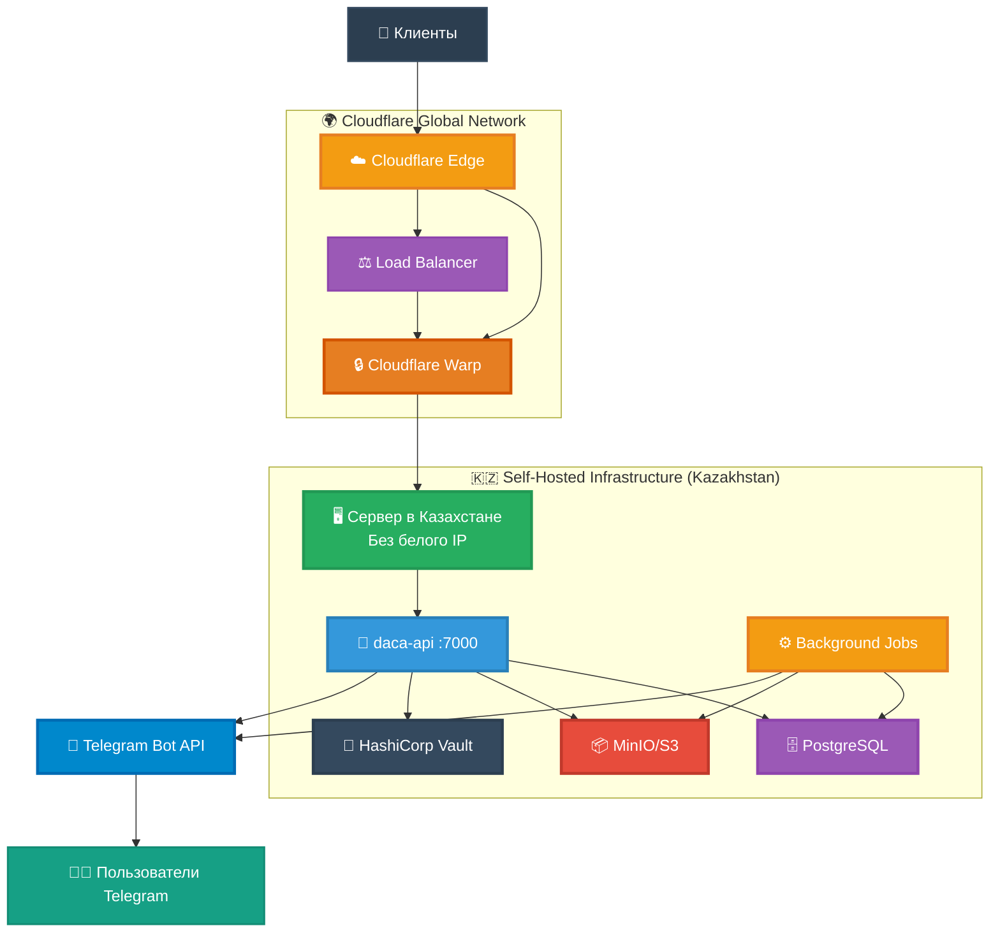
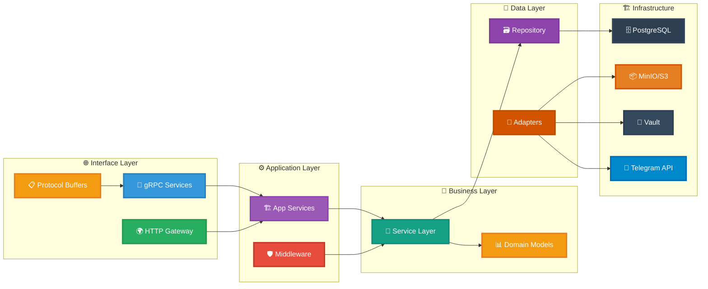
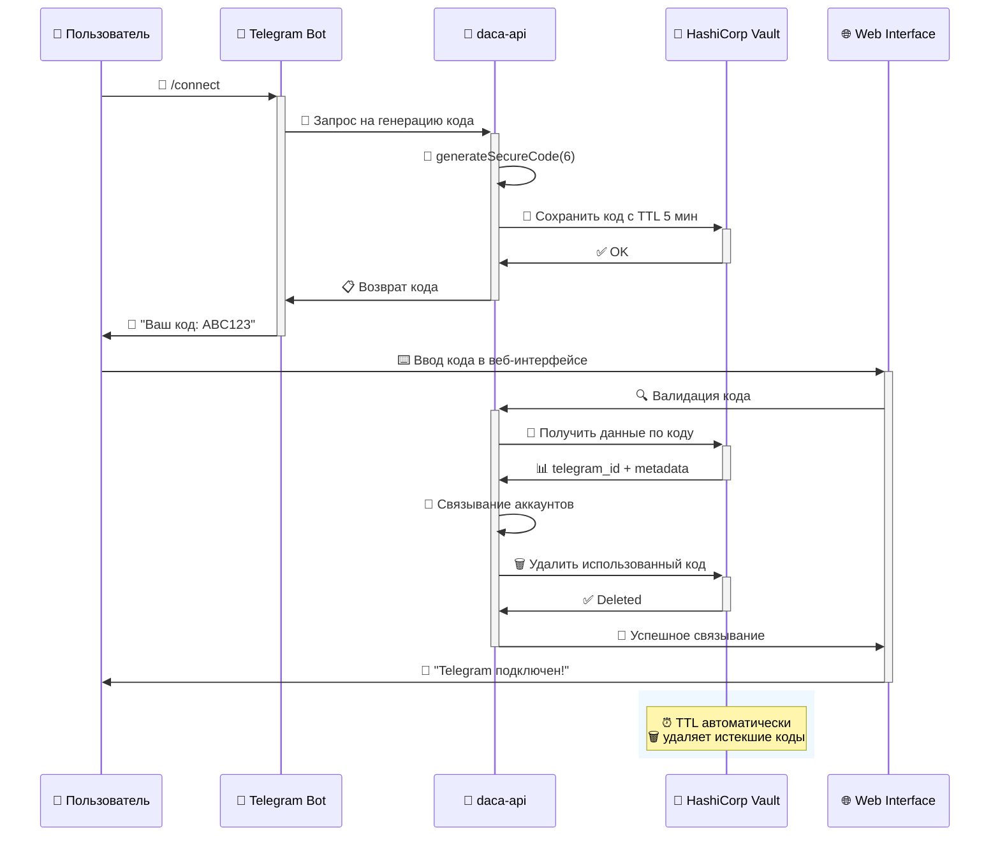
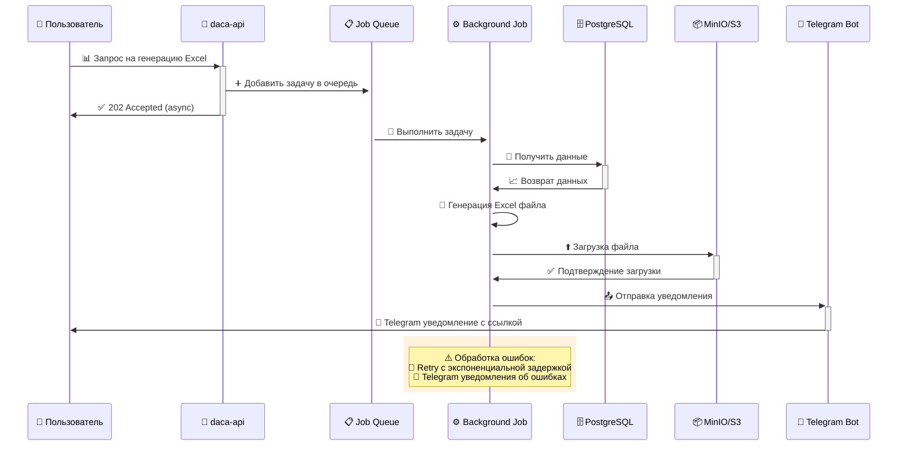
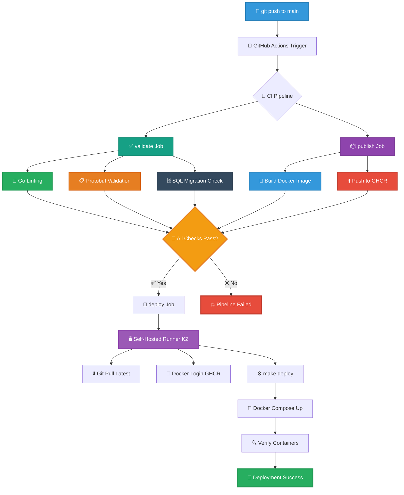
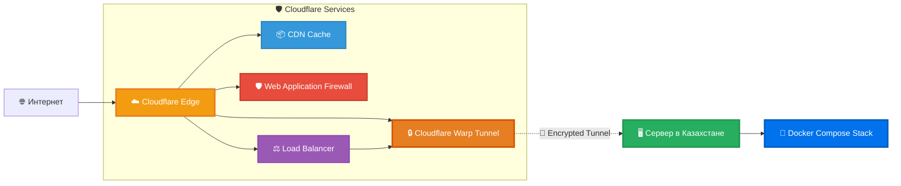

Комплексная система анализа государственных закупок, построенная на современных принципах архитектуры с разделением ответственности, type-safe контрактами и автоматизацией процессов.

## Обзор архитектуры

Система построена по принципу модульной архитектуры с четким разделением слоев и использованием современного технологического стека.

### Общая архитектура системы



### Технологический стек

**Backend (Go)**

- **Язык**: Go 1.24.4
- **API**: gRPC + gRPC-Gateway (dual gRPC/REST)
- **База данных**: PostgreSQL 15+ с pgx драйвером
- **Файловое хранилище**: MinIO (S3-совместимое)
- **Аутентификация**: JWT с ролевой моделью доступа
- **Генерация кода**: Protocol Buffers + buf toolchain
- **Уведомления**: Telegram Bot API
- **Управление секретами**: HashiCorp Vault
- **Фоновые задачи**: go-co-op/gocron v2

### Архитектурные принципы

**Clean Architecture и DDD (Domain‑Driven Design)**

```
┌─ Interface Layer   ─┐  ┌─ Application Layer ─┐  ┌─ Domain Layer   ─┐  ┌─ Infrastructure  ─┐
│ • gRPC/HTTP         │  │ • Services          │  │ • Business Logic │  │ • PostgreSQL      │
│ • Protocol Buffers  │  │ • Use Cases         │  │ • Entities       │  │ • MinIO/S3        │
│ • REST Gateway      │  │ • Orchestration     │  │ • Value Objects  │  │ • Telegram API    │
└─────────────────────┘  └─────────────────────┘  └──────────────────┘  └───────────────────┘
```

**Ключевые архитектурные решения:**

- **Инверсия зависимостей (Dependency Inversion)**: Интерфейсы задают контракты, реализации инжектируются
- **Принцип единственной ответственности (Single Responsibility)**: У компонента одна причина для изменения
- **Разделение интерфейсов (Interface Segregation)**: Клиенты не зависят от лишних методов
- **Fail‑fast**: Ошибки выявляются и сообщаются сразу

## Архитектура Backend

### Структура проекта

```
cmd/
├── api/              # Главный API сервер
└── cronjobs/         # Фоновые процессы
    ├── telegram_bot/      # Telegram бот
    └── process_*/         # Аналитические процессы

internal/
├── app/              # Бизнес-логика приложения
│   ├── auth/             # Аутентификация и авторизация
│   ├── contract_diff/    # Анализ различий контрактов
│   ├── dumping_contracts/ # Обнаружение демпинга
│   └── unload_excel/     # Генерация Excel отчетов
├── service/          # Сервисный слой
├── repository/       # Слой доступа к данным
├── model/            # Доменные модели
│   ├── auth/             # Модели аутентификации
│   ├── contract/         # Модели контрактов
│   └── company/          # Модели компаний
├── adapter/          # Адаптеры внешних сервисов
│   ├── s3/               # MinIO/S3 интеграция
│   ├── telegram/         # Telegram Bot API
│   └── vault/            # HashiCorp Vault
├── pb/               # Генерируемые Protocol Buffer типы
├── middleware/       # HTTP/gRPC middleware
└── tools/            # Вспомогательные утилиты

api/                  # Protocol Buffer определения
migrations/           # Миграции базы данных
```

### Слои архитектуры (схема, backend)



### API‑дизайн на базе Protocol Buffers

**Контракт‑Design (contract‑first)**

```protobuf
service AuthService {
  rpc Login(LoginRequest) returns (LoginResponse) {
    option (google.api.http) = {
      post: "/v1/auth/login"
      body: "*"
    };
  }
}

message User {
  string username = 1 [(google.api.field_behavior) = REQUIRED];
  string name = 2 [(google.api.field_behavior) = REQUIRED];
  repeated shared.v1.UserRole roles = 3;
  repeated shared.v1.Region regions = 4;
}
```

**Преимущества подхода:**

- **Типобезопасность**: Автоматическая генерация строго типизированного кода
- **Обратная совместимость**: Эволюция API без breaking‑changes
- **Мультиязычность**: Один контракт для клиентов на разных языках
- **Самодокументируемость**: Контракт служит спецификацией API
- **Валидация по схеме**: Ограничения и аннотации на уровне protobuf

### Слои архитектуры (описание)

Ниже короткое пояснение основных слоев системы и их ролей.

**Domain Layer (Доменный слой)**

- Бизнес-логика независимая от внешних зависимостей
- Доменные модели с инкапсулированным поведением
- Бизнес-правила и ограничения
- Value Objects для типобезопасности

**Application Layer (Слой приложения)**

- Координация между доменными объектами
- Use Cases и сценарии использования
- Транзакционность и согласованность данных
- Интеграция с внешними сервисами

**Infrastructure Layer (Слой инфраструктуры)**

- Реализации репозиториев (PostgreSQL)
- Внешние интеграции (Telegram, S3, Vault)
- Техническая логика (логирование, метрики)
- Конфигурация и окружение

### Фоновые процессы и задачи

**Архитектура cronjobs:**

```go
// Современный подход с go-co-op/gocron v2
scheduler := gocron.NewScheduler()

job := scheduler.NewJob(
    gocron.CronJob("0 */4 * * *", false), // Каждые 4 часа
    gocron.NewTask(processContracts),
    gocron.WithSingletonMode(gocron.LimitModeReschedule),
    gocron.WithEventListeners(
        gocron.AfterJobRuns(logJobCompletion),
        gocron.AfterJobRunsWithError(notifyError),
    ),
)
```

**Принципы фоновой обработки:**

- **Idempotency**: Повторные запуски безопасны
- **Retry Logic**: Экспоненциальная задержка при ошибках
- **Singleton Jobs**: Предотвращение параллельного выполнения
- **Наблюдаемость**: Логирование и мониторинг всех операций
- **Graceful Shutdown**: Корректное завершение при остановке

## Интеграции и внешние сервисы

### Интеграция Telegram‑бота

**Архитектура бота:**

- **Polling Service**: Отдельный процесс для получения сообщений
- **Command Handlers**: Обработка команд (/start, /connect, /help)
- **Account Linking**: Связывание через временные коды в Vault
- **Notifications**: Уведомления о готовности выгрузок

**Процесс связывания аккаунтов:**



**Безопасность связывания аккаунтов:**

```go
// Генерация временного кода
code := generateSecureCode(6)
err := vaultClient.StoreWithTTL(ctx,
    fmt.Sprintf("telegram/codes/%s", code),
    map[string]interface{}{
        "telegram_id": telegramID,
        "username":    username,
    },
    5*time.Minute, // TTL 5 минут
)
```

### HashiCorp Vault

**Управление секретами:**

- **Временные коды**: Автоматическое истечение через TTL
- **API ключи**: Централизованное хранение секретов
- **Database Credentials**: Динамические базы данных
- **Health Monitoring**: Мониторинг доступности Vault

### Хранилище MinIO/S3

**Файловое хранилище:**

- **Excel Exports**: Генерация отчетов в фоне
- **Presigned URLs**: Безопасная загрузка файлов
- **Bucket Policies**: Управление доступом к файлам
- **Lifecycle Management**: Автоматическая очистка старых файлов

## Бизнес-логика и аналитика

### Риск‑индикаторы

**Система анализа рисков:**

- **Contract Diff Analysis**: Сравнение контрактов и выявление аномалий
- **Dumping Detection**: Обнаружение демпинговых предложений
- **Supplier-Customer Networks**: Анализ связей между участниками
- **Problematic Patterns**: Выявление проблемных паттернов закупок

**Алгоритмические подходы:**

- **Statistical Analysis**: Статистические методы выявления аномалий
- **Graph Analysis**: Анализ графов связей между организациями
- **Pattern Matching**: Сопоставление с известными схемами нарушений
- **Machine Learning**: Обучение моделей на исторических данных

### Индикаторы риска государственных закупок

Система реализует комплексный анализ контрактов для выявления потенциальных нарушений и аномалий в сфере государственных закупок.

#### 1. Сверхдемпинговые контракты

**Цель**: Выявление контрактов с аномально низкой стоимостью по сравнению с плановой суммой.

**Параметры**:

- **P** — плановая сумма контракта
- **C** — фактическая сумма контракта
- **T** — пороговый коэффициент демпинга

**Формула расчета**:

```
Процент снижения = (P - C) × 100 / P
```

**Условие срабатывания**: Процент снижения превышает установленный порог

#### 2. Контракты с минимальным демпингом

**Цель**: Выявление контрактов с незначительным, но подозрительно точным снижением цены.

**Логика**: Контракт почти равен плановой сумме, но с небольшим снижением, что может указывать на предварительный сговор.

**Формула расчета**:

```
Процент снижения = (P - C) × 100 / P
```

**Условие**: Фактическая сумма близка к плановой с небольшим отклонением в пределах установленного порога

#### 3. Ускоренное согласование оплаты

**Цель**: Обнаружение подозрительно быстрых платежей после заключения контракта.

**Параметры**:

- **Dcontract** — дата создания контракта
- **Dpayment** — дата платежа

**Условие срабатывания**:

```
Dpayment - Dcontract < установленного_порога_дней
```

**Дополнительные фильтры**: Учитываются только годовые государственные контракты с определенными статусами.

#### 4. Увеличение суммы контракта

**Цель**: Выявление контрактов с существенным увеличением суммы в процессе исполнения.

**Параметры**:

- **Sfirst** — сумма первоначального контракта
- **Slast** — сумма финального контракта
- **Ffirst** — фактическая сумма первого этапа
- **Flast** — фактическая сумма последнего этапа

**Формулы расчета**:

```
Рост суммы = (Slast - Sfirst) × 100 / Sfirst
Рост факта = (Flast - Ffirst) × 100 / Ffirst
```

**Условие срабатывания**: Любой из показателей роста превышает установленный порог

#### 5. Анализ партнерства заказчик–поставщик

**Цель**: Выявление подозрительно тесных связей между заказчиками и поставщиками.

**Параметры**:

- **Npair** — количество контрактов в анализируемой паре
- **Nsupplier** — общее количество контрактов поставщика
- **Ncustomer** — общее количество контрактов заказчика

**Формулы расчета**:

```
Доля поставщика = Npair / Nsupplier
Доля заказчика = Npair / Ncustomer
```

**Условия фильтрации**: Пара попадает в отчет только если:

- Количество контрактов в паре превышает минимальный порог
- Обе доли превышают установленные пороговые значения

#### 6. Общие фильтры и ограничения

**Типы контрактов**: Анализируются только годовые и стандартные контракты

**Требования к данным**:

- Обязательное наличие БИН заказчика и поставщика
- Суммы контрактов должны быть больше нуля
- Для большинства расчетов используются только корневые контракты

**Статусы контрактов**: Учитываются контракты с определенными статусами, исключающие черновики и отмененные контракты

### Конвейер генерации Excel

**Архитектура генерации отчетов:**

1. **Обработка запроса**: Асинхронное принятие и постановка в очередь
2. **Агрегация данных**: Сбор из нескольких источников
3. **Генерация Excel**: Создание файла на базе excelize v2
4. **Загрузка в S3**: Отправка в объектное хранилище
5. **Уведомление в Telegram**: Сообщение пользователю о готовности



```go
// Пример архитектуры обработки
type ExcelProcessor struct {
    repo      Repository
    storage   S3Client
    telegram  TelegramClient
    templates ExcelTemplates
}

func (p *ExcelProcessor) ProcessRequest(ctx context.Context, req ExportRequest) error {
    // 1. Валидация запроса
    // 2. Извлечение данных
    // 3. Генерация Excel
    // 4. Загрузка в S3
    // 5. Отправка уведомления
}
```

## DevOps и развертывание

### CI/CD Pipeline

**GitHub Actions Workflows:**

```yaml
# CI Pipeline - основной поток
name: CI Pipeline
on:
  push:
    branches: [main]
  pull_request:
    branches: [main]

jobs:
  validate: # Линтинг и проверки качества
  publish: # Сборка и публикация Docker образов
  deploy: # Автоматическое развертывание
```

**Workflow файлы:**

- **ci-pipeline.yaml**: Основной CI/CD поток
- **auto-deploy.yaml**: Развертывание на self-hosted runner
- **lint.yaml**: Комплексные проверки (Go, protobuf, SQL)
- **publish.yaml**: Сборка и публикация образов

### CI/CD Flow



### Deployment Strategy

**Гибридная инфраструктура с Cloudflare:**

**Cloudflare Edge Layer:**

- **CDN и защита**: Глобальная сеть Cloudflare для кеширования и DDoS защиты
- **Load Balancer**: Встроенный балансировщик нагрузки с health checks
- **SSL Termination**: Автоматические SSL сертификаты и TLS encryption
- **Geographic Routing**: Оптимизация маршрутизации для пользователей из СНГ

**Cloudflare Warp Integration:**



**Решение проблемы серого IP:**

- **Cloudflare Warp Tunnel**: Безопасный туннель между Edge и origin сервером
- **Zero Trust Architecture**: Нет необходимости в белом IP адресе
- **Automatic Failover**: Автоматическое переключение при сбоях
- **End-to-End Encryption**: Шифрование трафика от клиента до сервера

**Self-Hosted Infrastructure (Казахстан):**

- **Location**: Астана, Казахстан - близость к основной аудитории
- **Network**: Серый IP с Warp tunnel для публичного доступа
- **Self-hosted runner**: GitHub Actions runner для автоматизации
- **Docker Compose**: Управление контейнерами через compose файлы
- **Multi-stage deployment**: Раздельные файлы для apps, databases, swagger

**Deployment Process:**

```bash
# Основной процесс развертывания
1. Git pull latest code
2. Docker login to GitHub Container Registry
3. make deploy - запуск через Makefile
4. Verification - проверка running containers
```

**Docker Compose Architecture:**

```yaml
# docker-compose.apps.yaml - основные сервисы
# docker-compose.databases.yaml - базы данных
# docker-compose.swagger.yaml - документация API
```

### Наблюдаемость

**Мониторинг и логирование:**

- **Structured Logging**: Структурированные логи с контекстом
- **Health Checks**: Проверки состояния всех компонентов
- **Performance Metrics**: Метрики производительности
- **Error Tracking**: Отслеживание и уведомления об ошибках

```go
// Пример структурированного логирования
logger.Info(ctx, "Processing export request",
    logger.WithString("export_type", exportType),
    logger.WithInt("user_id", userID),
    logger.WithString("request_id", requestID),
)
```

## Масштабируемость и производительность

### Проектирование базы данных

**PostgreSQL оптимизация:**

- **Индексирование**: Составные индексы для аналитических запросов
- **Партиционирование**: Разделение больших таблиц по датам
- **Connection Pooling**: Пул соединений с pgx
- **Query Optimization**: Анализ и оптимизация медленных запросов

### Стратегия кэширования

**Многоуровневое кэширование:**

- **Application Cache**: In‑memory кэш в приложении
- **Database Cache**: Кэширование результатов запросов
- **CDN Cache**: Кэширование статических ресурсов
- **Browser Cache**: Клиентское кэширование через HTTP‑заголовки

### Асинхронная обработка

**Фоновая обработка:**

- **Job Queues**: Очереди задач для тяжелых операций
- **Batch Processing**: Пакетная обработка больших объемов данных
- **Stream Processing**: Потоковая обработка в реальном времени
- **Rate Limiting**: Ограничение нагрузки на внешние API

## Безопасность

### Аутентификация и авторизация

**Многоуровневая безопасность:**

- **JWT Tokens**: Stateless аутентификация с коротким TTL
- **Role-Based Access**: Ролевая модель с региональными ограничениями
- **Token Refresh**: Обновление токенов без повторной аутентификации
- **Session Management**: Управление сессиями пользователей

### Защита данных

**Защита данных:**

- **Input Validation**: Валидация на всех уровнях
- **SQL Injection Prevention**: Параметризованные запросы
- **XSS Protection**: Санитизация пользовательского ввода
- **CORS Configuration**: Настройка политик CORS

### Безопасность инфраструктуры

**Безопасность инфраструктуры:**

- **Secrets Management**: Централизованное управление через Vault
- **Network Security**: Изоляция сервисов через Docker networks
- **SSL/TLS**: Шифрование всех соединений
- **Regular Updates**: Регулярные обновления зависимостей

## Выводы

Архитектура DACA представляет собой современный подход к построению enterprise-приложений с акцентом на:

**Качество архитектуры:**

- Clean Architecture для сопровождаемости
- Типобезопасность на всех уровнях
- Contract‑first дизайн API
- Комплексная стратегия тестирования

**Developer Experience:**

- Автоматическая генерация кода
- Горячая перезагрузка в разработке
- Полная документация
- Современные инструменты

**Operational Excellence:**

- Полный мониторинг
- Автоматизированное тестирование
- План восстановления после сбоев

Эта архитектура демонстрирует, как современные паттерны и технологии применяются для создания надежных, масштабируемых и хорошо поддерживаемых систем в домене государственных закупок.

## Технические детали

Полная документация API доступна через Swagger UI, исходный код следует принципам Clean Code, а развертывание автоматизировано через CI/CD пайплайны. Система успешно обрабатывает миллионы записей контрактов и обеспечивает аналитические инсайты для принятия решений в сфере государственных закупок.
